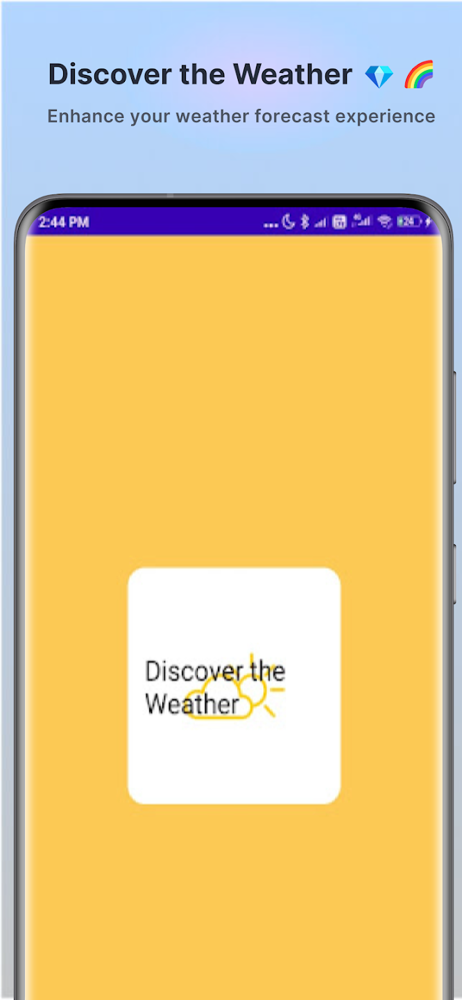
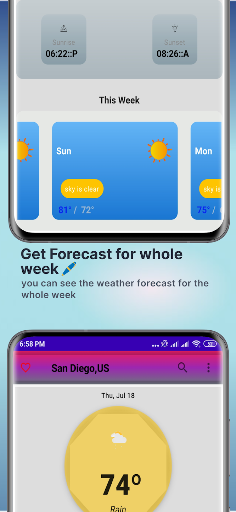
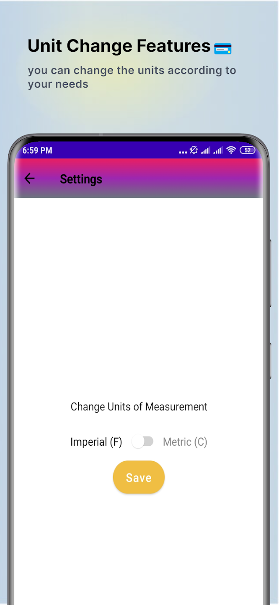

# 🌤️ Weather Forecast App

A modern Android weather application built with Jetpack Compose, MVVM architecture, and powered by a weather API. The app provides current weather conditions and forecasts for locations worldwide.

## ✨ Features

- **Current Weather**: View current weather conditions including temperature, humidity, wind speed, and more
- **5-Day Forecast**: Get detailed weather forecasts for the next 5 days
- **Location Search**: Search for weather by city name
- **Favorites**: Save favorite locations for quick access
- **Dark/Light Theme**: Supports both light and dark themes
- **Unit Conversion**: Switch between metric and imperial units
- **Responsive UI**: Beautiful and intuitive user interface built with Material Design 3

## 🛠️ Tech Stack

- **Language**: Kotlin
- **UI**: Jetpack Compose
- **Architecture**: MVVM (Model-View-ViewModel)
- **Dependency Injection**: Dagger Hilt
- **Networking**: Retrofit with Gson
- **Database**: Room
- **Asynchronous Programming**: Kotlin Coroutines & Flow
- **Image Loading**: Coil
- **Animation**: Lottie

## 📱 Screenshots


 

## 🚀 Getting Started

### Prerequisites

- Android Studio Flamingo (2022.2.1) or later
- Android SDK 24 or higher
- Kotlin 1.8.0 or higher
- JDK 17

### Installation

1. Clone the repository:
   ```bash
   git clone https://github.com/vardhanyadav1714/WeatherForecastApp
   ```

2. Open the project in Android Studio

3. Get an API key from [OpenWeatherMap](https://openweathermap.org/api)

4. Create a `local.properties` file in the root directory if it doesn't exist and add your API key:
   ```properties
   API_KEY=your_api_key_here
   ```

5. Sync the project with Gradle files

6. Build and run the app on your device or emulator

## 🏗️ Project Structure

```
app/
├── src/
│   ├── main/
│   │   ├── java/com/example/weatherforecastapp/
│   │   │   ├── data/           # Data layer (DAO, Database, Data classes)
│   │   │   ├── di/             # Dependency injection modules
│   │   │   ├── model/          # Data models
│   │   │   ├── navigation/     # Navigation components
│   │   │   ├── network/        # API service and network related code
│   │   │   ├── repository/     # Repository pattern implementation
│   │   │   ├── screens/        # UI screens
│   │   │   │   ├── about/      # About screen
│   │   │   │   ├── favorites/  # Favorites screen
│   │   │   │   ├── main/       # Main weather screen
│   │   │   │   ├── search/     # Search screen
│   │   │   │   ├── settings/   # Settings screen
│   │   │   │   └── splash/     # Splash screen
│   │   │   ├── ui/             # UI components and theme
│   │   │   ├── util/           # Utility classes
│   │   │   ├── MainActivity.kt
│   │   │   └── WeatherApplication.kt
│   │   └── res/                # Resources
```

## 🧪 Testing

Run the tests using Android Studio or with the following command:

```bash
./gradlew test
```

## 📄 License

This project is licensed under the MIT License - see the [LICENSE](LICENSE) file for details.

## 🙏 Acknowledgments

- [OpenWeatherMap](https://openweathermap.org/) for the weather data API
- Jetpack Compose for the modern UI toolkit
- All the open-source libraries used in this project

## 📝 Notes

- The app requires an internet connection to fetch weather data
- Location permission is required for automatic location detection
- The free tier of OpenWeatherMap API has rate limits

## 📱 Download From Play Store
https://play.google.com/store/apps/details?id=com.discoverthe.weatherforecastapp&hl=en_IN

---

Made with ❤️ by Vardhan Yadav
